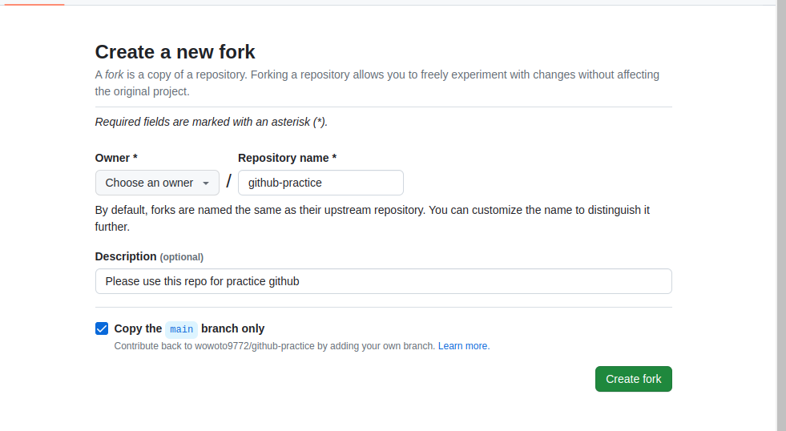

# Fork this repo


First, you should fork this repo.



And please clone your own repo.

```bash
git clone <your-own-repo>
```

# Create branch

You can checkout from your main.

```bash
cd 2_your_workspace

git checkout -b "new-branch"
```

Now, your branch name is new-branch.

```bash
git branch
```

Then, you can get, below.

```bash
  main
* new-branch
```

# Use stash

Please add simple text to shared_file.txt.

```bash
echo "test for stash." >> shared_file.txt
```

And you can know the diffs.

```bash
git diff
```

And you can get, below.
```bash
diff --git a/2_your_workspace/shared_file.txt b/2_your_workspace/shared_file.txt
index 2b6a997..4391be1 100644
--- a/2_your_workspace/shared_file.txt
+++ b/2_your_workspace/shared_file.txt
@@ -1 +1,2 @@
 This file is shared with other people.
+test for stash.
```

And now, you cat use stash for unchanged (backup).
```bash
git stash
git status
```

And you can rollback the changed one.
```bash
git stash pop
```

And you can get, below.
```bash
Dropped refs/stash@{0} (....???...)
```

# Update remote (new-branch)

You can update remote.

```bash
git add shared_file.txt
git commit -m "Add stash text to shared_file.txt"
git push origin new-branch
```

And, your own remote is updated (new-branch).

```bash
remote: Create a pull request for 'new-branch' on GitHub by visiting:
remote:      https://github.com/wowoto9772/github-practice/pull/new/new-branch
remote: 
To github.com:wowoto9772/github-practice.git
 * [new branch]      new-branch -> new-branch
```