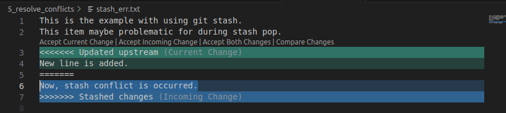
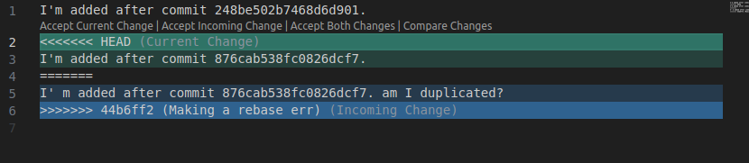

# Git conflict during stash

Please make the branch for conflict test.

```bash
git checkout -b 5-test-stash-err
```

And, you just add line to stash_err.txt.

```bash
echo "Now, stash conflict is occurred." >> stash_err.txt
git diff
```

If we have to get new branch's contents,
Then, stash is required.

```bash
git stash
git rebase wowoto/5-occur-stash-err
```

And, you can stash pop your previous saved.

```bash
git stash pop
```

And, you can know the conflicts by stash pop.

```bash
Auto-merging 5_resolve_conflicts/stash_err.txt
CONFLICT (content): Merge conflict in 5_resolve_conflicts/stash_err.txt
The stash entry is kept in case you need it again.
```

And you can know the details.

```bash
git diff
```

And this is the diffs.

```bash
diff --cc 5_resolve_conflicts/stash_err.txt
index 5d641a4,c001e84..0000000
--- a/5_resolve_conflicts/stash_err.txt
+++ b/5_resolve_conflicts/stash_err.txt
@@@ -1,3 -1,3 +1,7 @@@
  This is the example with using git stash.
  This item maybe problematic for during stash pop.
- New line is added.
 -Now, stash conflict is occurred.
++<<<<<<< Updated upstream
++New line is added.
++=======
++Now, stash conflict is occurred.
++>>>>>>> Stashed changes
```

Now, you should decide to keep both changes, or not.
You can edit in vscode, vim, etc.



And this is the desired when we choose both changes.

```bash
This is the example with using git stash.
This item maybe problematic for during stash pop.
New line is added.
Now, stash conflict is occurred.
```

And after fixed it, you can use for staged.

```bash
git add stash_err.txt

# if you want to set unstaged, then
# use "git reset HEAD stash_err.txt"
```

# Git conflict during rebase

Please make the temporary branch for conflict test.

```bash
git checkout -b 5-test-rebase-err
```

And create 1 commit, now.

```bash
echo "I' m added after commit 876cab538fc0826dcf7. am I duplicated?" >> rebase_err.txt

# And check the diffs.
git diff

# Change to staged.
git add rebase_err.txt

# Acc commit with message.
git commit -m "Making a rebase err"
```

And, get contents another branch's.

```bash
git rebase wowoto/5-occur-rebase-err
```

And, you can check the conflicts.

```bash
Auto-merging 5_resolve_conflicts/rebase_err.txt
CONFLICT (content): Merge conflict in 5_resolve_conflicts/rebase_err.txt
error: could not apply ????... Making a rebase err
hint: Resolve all conflicts manually, mark them as resolved with
hint: "git add/rm <conflicted_files>", then run "git rebase --continue".
hint: You can instead skip this commit: run "git rebase --skip".
hint: To abort and get back to the state before "git rebase", run "git rebase --abort".
Could not apply ????... Making a rebase err
```

If you think something wrong, you can use for cancel.

```bash
git rebase --abort
```

And, if you decide to resolve conflicts,  
You should pick both or one of selections for resolve.



And, desired is below.

```bash
I'm added after commit 248be502b7468d6d901.
I'm added after commit 876cab538fc0826dcf7.
I' m added after commit 876cab538fc0826dcf7. am I duplicated?
```

And, after resolve the conflicts, you can update changes.

```bash
git add rebase_err.txt
git rebase --continue
```

And, you can get the below.

```bash
[detached HEAD 2224063] Making a rebase err
 1 file changed, 2 insertions(+), 1 deletion(-)
Successfully rebased and updated refs/heads/5-test-rebase-err.
```

You can confirm the updates.

```bash
# only commit log.
git log

# the diffs.
git log -p 

# (commit-id can be omitted.)
# git log -p <commit-id> 
```